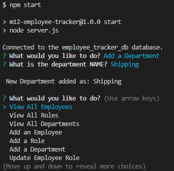

 

# M12 - Employee Tracker

## Description

Employee Tracker is a CLI application that takes user input in order to update a database. It was made in order to practice mySQL. The application allows the user view, update, and add employees, roles, and departments.

While building this project I learned to:
- Structure a database using mySQL
- Select data from a self referencing table using Recursive CTE
- Use CRUD on a database

### Built With

   

## Table of Contents
- [Installation](#installation)
- [Usage](#usage)
- [License](#license)
- [Contact](#contact)

## Installation

1. Clone the repo down to your local machine.
2. If you don't have Node.js, navigate to [nodejs.org](https://nodejs.org/en/) & download v16.18.0 or LTS.
3. Open the directory in your terminal and run `npm i` .

(<a href="#readme-top">back to top</a>)

## Usage

Open your terminal, and in the command line run 

	npm start

Follow the prompts and answer as accurately as possible.

Navigate using your arrow keys. In order to exit the questions once you are back on the menu select `Quit` from the options. 

For an example of the application at work see the:
- Video: [drive.google.com](https://drive.google.com/file/d/16ppX5tx42wobx9fnDh86LwEwzxS7R35P/view)

(<a href="#readme-top">back to top</a>)

## License

Distributed under the MIT License. See [LICENSE](./LICENSE) for more information.

(<a href="#readme-top">back to top</a>)

## Contact

For any further questions feel free to contact me via:
- GitHub: [Mateo-Wallace](https://github.com/Mateo-Wallace)
- Email: [mateo.t.wallace@gmail.com](mailto:mateo.t.wallace@gmail.com)
- LinkedIn: [Mateo Wallace](https://www.linkedin.com/in/mateo-wallace-57931b254/)

(<a href="#readme-top">back to top</a>)
